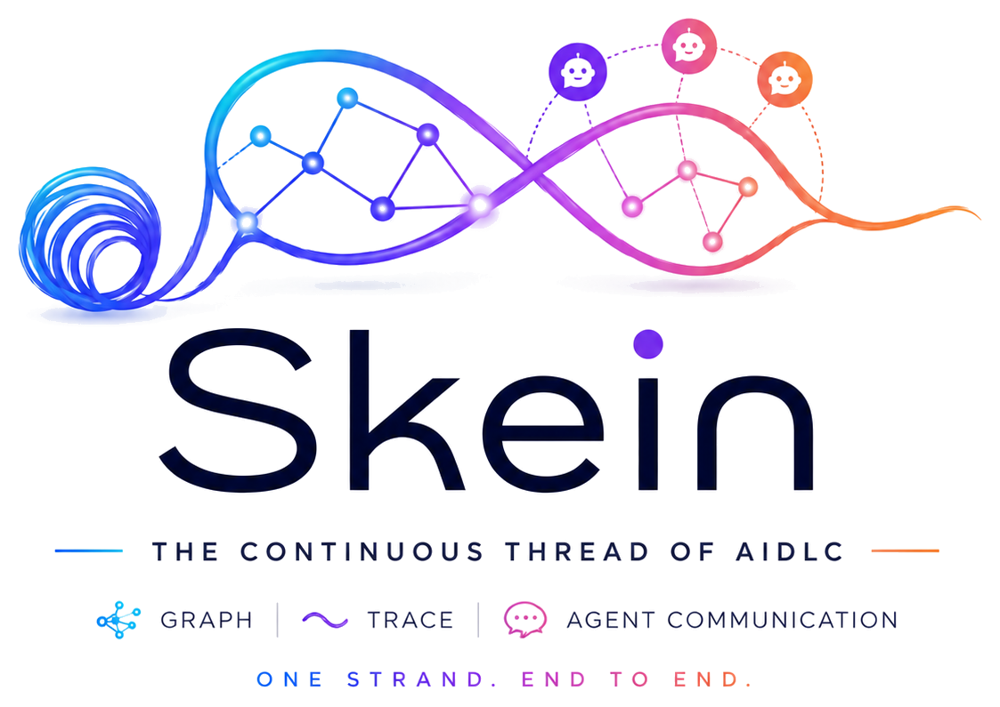
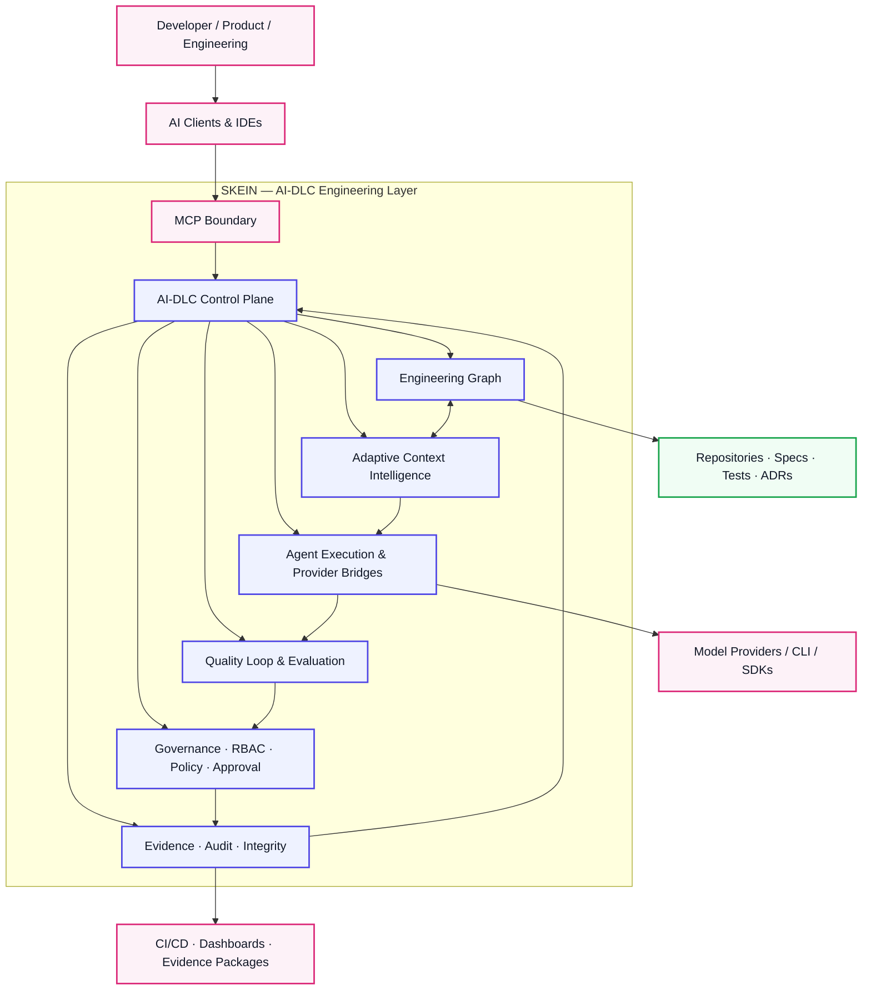
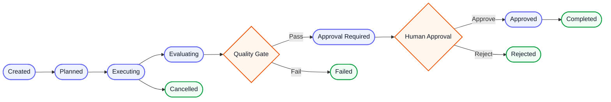
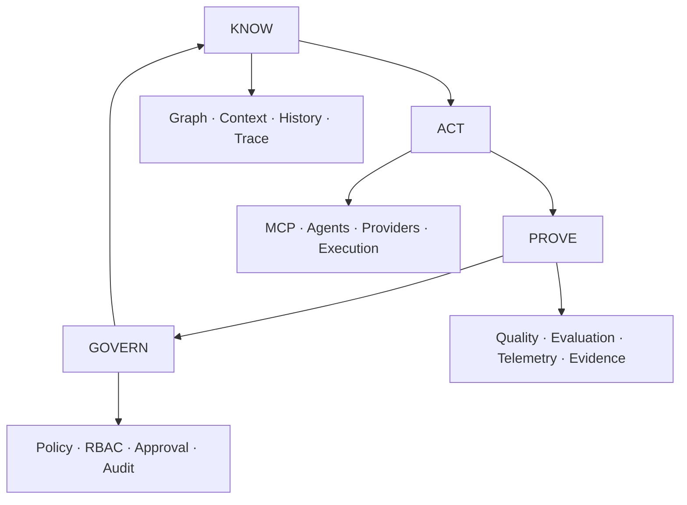
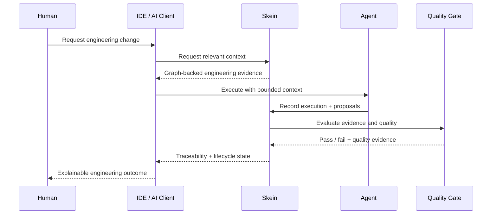
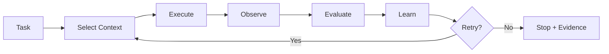

<p align="center">
  
</p>

<p align="center">
  <strong>The Continuous Thread of AI-DLC</strong><br/>
  Graph · Context · Trace · Agent Communication · Governance · Evidence
</p>

<p align="center"><em>One strand. End to end.</em></p>

<p align="center">
  
  
  
  
  
  
</p>

> **Skein is the persistent engineering context, execution, governance and evidence layer for AI-driven software development.**
>
> Agents can change. Models can change. IDEs can change. **The engineering thread should not.**

---

## ⚡ 30-Second Quick Start

```bash
# 1. Install
python -m venv .venv
source .venv/bin/activate
pip install -e '.[dev]'

# 2. Initialize + ingest a project
skein init .
skein ingest .

# 3. Query engineering context
skein query . "payment authorization"

# 4. Connect an AI client through MCP
skein mcp-stdio .

# 5. Run the verification suite
pytest -q
```

**Current release baseline:** `v1.0.0` · `78/78 tests passing` · MCP `stdio + HTTP` · AI-DLC Control Plane available.

> **Want the shortest possible mental model?**
> `Repository → Graph → Context → Agent → Quality → Governance → Evidence`

---

## 🧭 What is Skein?

Modern AI engineering is moving from a single developer using a coding assistant toward **AI-DLC**: multiple agents, multiple models, automated execution, continuous evaluation and increasingly autonomous engineering workflows.

The hard problem is no longer only **“Can an agent write code?”**

It is:

> **“Can we give agents the right engineering context, preserve traceability, measure outcomes, enforce policy and produce trustworthy evidence across the lifecycle?”**

That is the problem Skein is designed to solve.

Skein creates a continuous thread across:

```text
Requirements / Specs
        │
        ▼
┌──────────────────────┐
│  Engineering Graph   │
│ code · tests · intent │
└──────────┬───────────┘
           │
           ▼
┌──────────────────────┐
│ Context Intelligence │
│ relevance · topology │
│ budget · diversity   │
└──────────┬───────────┘
           │
           ▼
┌──────────────────────┐
│ Agent Execution      │
│ MCP · providers      │
│ adapters · telemetry │
└──────────┬───────────┘
           │
           ▼
┌──────────────────────┐
│ Quality + Governance │
│ gates · policy · RBAC│
│ approval · audit     │
└──────────┬───────────┘
           │
           ▼
┌──────────────────────┐
│ Evidence             │
│ trace · outcome      │
│ integrity · replay   │
└──────────────────────┘
```

### The thesis

> **AI agents should be replaceable. Engineering context should not.**

Skein is therefore **not another coding agent**. It is the engineering layer around agents.

---

# Why Skein?

Without a persistent engineering context, every agent tends to reconstruct its own view of the system:

```text
Agent A → Repository → Context A
Agent B → Repository → Context B
Agent C → Repository → Context C
Agent D → Repository → Context D
```

The result is fragmented context, duplicated discovery, inconsistent assumptions and weak traceability.

Skein changes the pattern:

```text
                 ┌─────────────────────┐
                 │       SKEIN         │
                 │ Continuous Thread   │
                 │ Graph · Context     │
                 │ Trace · Evidence    │
                 └──────────┬──────────┘
                            │
          ┌─────────────────┼─────────────────┐
          │                 │                 │
       Planner          Developer          Tester
          │                 │                 │
          └─────────────────┼─────────────────┘
                            │
                     Quality + Policy
                            │
                         Evidence
```

The agents can remain specialized. **The engineering context remains continuous.**

---

# 🏗️ Architecture at a Glance



### Architectural principle

Skein sits **between engineering systems and AI clients**.

It does not require replacing the developer's IDE, model provider, CI/CD system or agent framework.

It provides the missing continuity layer.

---

# ✨ Capability Cards

<table>
<tr>
<td width="50%" valign="top">

### 🧠 Engineering Graph

Build a queryable representation of engineering structure and relationships.

**Includes**
- Files, functions, classes
- Requirements, tickets, ADRs
- Test cases
- Calls and imports
- Intent and verification relationships
- Cross-file resolution

</td>
<td width="50%" valign="top">

### 🎯 Adaptive Context Intelligence

Select the engineering evidence an agent actually needs instead of flooding its context window.

**Considers**
- Relevance
- Graph connectivity
- Bounded feedback
- Diversity
- Token/context budgets
- Deterministic selection

</td>
</tr>
<tr>
<td valign="top">

### 🔗 Traceability

Connect intent → implementation → verification.

Answer questions such as:

- What implements this requirement?
- Which tests cover it?
- What is affected by this change?
- What changed between graph versions?

</td>
<td valign="top">

### 🤖 Agent Communication

Provide a shared engineering context for multi-agent workflows.

Planner, developer, tester, security and reviewer agents can work against the same persistent engineering thread.

</td>
</tr>
<tr>
<td valign="top">

### 🔌 MCP Integration

Expose Skein through an MCP-compatible boundary.

**Available transports**
- stdio
- HTTP

**Core tools**
- `query_graph`
- `get_subgraph`
- `get_traceability`
- `get_diff`
- `propose_node`
- `propose_edge`
- `commit_proposal`

</td>
<td valign="top">

### 🔐 Governance & Control

Keep AI-driven engineering policy-controlled.

**Controls**
- Identity
- RBAC
- Proposals
- Approval gates
- Policy enforcement
- Audit events
- Risk classification
- Integrity verification

</td>
</tr>
<tr>
<td valign="top">

### 🔄 Autonomous Quality Loop

A bounded feedback loop for agentic engineering.

`Task → Select → Execute → Observe → Evaluate → Learn → Retry`

With explicit iteration limits, quality evaluators and append-only feedback.

</td>
<td valign="top">

### 📦 Evidence & Measurement

Treat engineering evidence as a first-class artifact.

Capture execution, context, quality and lifecycle evidence without turning unsupported measurements into marketing claims.

</td>
</tr>
</table>

---

# 🔄 The AI-DLC Lifecycle


The Control Plane makes lifecycle state explicit rather than treating “agent finished” as “engineering complete.”



> GitHub's Mermaid renderer does not support arbitrary CSS animation. This diagram is intentionally GitHub-safe; the lifecycle is designed to read as a continuous flow rather than relying on non-portable animation.

### The key shift

```text
Agent completed
      ≠
Engineering completed
```

Skein asks for:

```text
Intent
  +
Context
  +
Execution
  +
Quality
  +
Authorization
  +
Evidence
  =
Engineering outcome
```

---

# 🧬 The Continuous Thread

Skein connects four fundamental concerns:



### KNOW

Understand the engineering system.

### ACT

Give agents controlled access to engineering context and execution capabilities.

### PROVE

Capture quality, traceability and outcome evidence.

### GOVERN

Ensure autonomous workflows remain policy-controlled and auditable.

---

# 🆚 Skein vs. the AI Engineering Ecosystem

Skein is not positioned as a replacement for the ecosystem. It is designed to **connect and complement it**.

```text
                         AI ENGINEERING STACK

 ┌─────────────────────────────────────────────────────────────┐
 │ IDE / Developer Experience                                  │
 │ VS Code · AI coding environments · internal developer tools │
 └──────────────────────────────┬──────────────────────────────┘
                                │
 ┌──────────────────────────────▼──────────────────────────────┐
 │ Agent / Workflow Layer                                      │
 │ LangGraph · AutoGen · CrewAI · custom orchestrators         │
 └──────────────────────────────┬──────────────────────────────┘
                                │
 ┌──────────────────────────────▼──────────────────────────────┐
 │ Retrieval / Knowledge Layer                                 │
 │ LlamaIndex · vector databases · search · RAG                │
 └──────────────────────────────┬──────────────────────────────┘
                                │
 ┌══════════════════════════════▼══════════════════════════════┐
 ║ SKEIN — CONTINUOUS ENGINEERING THREAD                     ║
 ║ Graph · Context · Trace · Execution · Quality · Governance ║
 ║ Evidence · AI-DLC Control Plane                            ║
 └══════════════════════════════┬══════════════════════════════┘
                                │
 ┌──────────────────────────────▼──────────────────────────────┐
 │ Engineering Systems                                        │
 │ Code · Tests · Specs · ADRs · CI/CD · operational evidence │
 └─────────────────────────────────────────────────────────────┘
```

| Technology / category | Primary concern | Skein's relationship |
|---|---|---|
| LangGraph | Agent/workflow orchestration | Complementary |
| LlamaIndex | Data, indexing and RAG | Complementary |
| AutoGen | Multi-agent orchestration | Complementary |
| CrewAI | Agent crews and workflows | Complementary |
| MCP | Agent/tool interoperability | Skein integration boundary |
| Tree-sitter | Source parsing | Ingestion building block |
| Vector databases | Similarity retrieval | Optional retrieval infrastructure |
| AI coding IDEs | Developer + agent experience | Client surface |
| **Skein** | **Engineering context + traceability + evidence + AI-DLC governance** | **Continuous engineering layer** |

> **Differentiation statement:** Skein is not trying to be the best agent framework. It is trying to make AI-driven engineering **contextual, traceable, measurable and governable across the lifecycle**.

---

# 🧩 How Skein Fits Into an Agentic Workflow



The important property is that the agent does not become the system of record for engineering context.

**Skein does.**

---

# 🔌 MCP in One Minute

Start Skein as a local MCP server:

```bash
skein mcp-stdio .
```

Or HTTP:

```bash
skein mcp-http . --host 127.0.0.1 --port 8765
```

A compatible AI client can then use Skein's tools to query engineering context, retrieve traceability, inspect graph diffs and participate in controlled proposal/commit workflows.

### Example MCP interaction

```text
Agent:
  “What is affected by changing payment authorization?”

Skein:
  → graph neighborhood
  → dependent functions
  → related requirements
  → related tests
  → recent graph changes
  → relevant engineering evidence
```

The agent receives **engineering context**, not an undifferentiated repository dump.

---

# 🖥️ IDE Integration

Skein is designed to work underneath the existing IDE experience.

For a VS Code MCP configuration:

```json
{
  "servers": {
    "skein": {
      "type": "stdio",
      "command": "skein",
      "args": ["mcp-stdio", "${workspaceFolder}"]
    }
  }
}
```

The architectural separation is intentional:

```text
IDE
 │
 ├── Developer experience
 ├── Agent interaction
 └── Code editing
        │
        ▼
       MCP
        │
        ▼
     SKEIN
        │
        ├── Context
        ├── Graph
        ├── Traceability
        ├── Governance
        └── Evidence
```

Skein does **not** require a custom IDE extension to become useful.

---

# 🌱 Greenfield Projects

Use Skein from the first vertical slice.

```text
Specification
     ↓
Vertical Slice
     ↓
Implementation
     ↓
Tests
     ↓
Graph
     ↓
Context Selection
     ↓
Agent Execution
     ↓
Quality
     ↓
Approval
     ↓
Evidence
```

Example:

```bash
skein init .
skein spec-check .
skein ingest . --message "initial vertical slice"
skein query . "checkout"
skein trace . --spec SKN-001
```

### Greenfield principle

> **Start small. Build evidence early. Grow the engineering graph with the system.**

Avoid creating a giant specification before the system has demonstrated what is real.

---

# 🏚️ Brownfield Projects

Brownfield engineering has a different starting point: an existing system full of implicit knowledge.

```text
Existing Repository
        ↓
      Ingest
        ↓
 Engineering Graph
        ↓
Characterize Behavior
        ↓
 Establish Trust
        ↓
 Define Specification
        ↓
   Bounded Change
        ↓
 Quality Verification
        ↓
     Approval
        ↓
      Evidence
```

The critical principle is:

> **Observed behavior is not automatically intent.**

Legacy behavior may represent a requirement, workaround, accidental dependency, historical defect or undocumented contract.

Skein helps preserve that distinction while changes are made.

---

# 🔄 Autonomous Quality Loop

Skein's quality loop is deliberately bounded.



The loop supports:

- Maximum iterations
- Bounded feedback
- Pluggable quality evaluation
- Append-only feedback
- Execution fingerprints
- Context fingerprints
- Explicit stop reasons

A successful model invocation is **not** treated as proof of engineering success.

---

# 🔐 Governance by Design

Skein separates **capability** from **authority**.

```text
Agent
 │
 ├── Can request context
 ├── Can propose actions
 └── Can execute within configured boundaries
             │
             ▼
      Identity + Policy
             │
             ▼
       Quality Gate
             │
             ▼
      Human Approval
             │
             ▼
           Commit
             │
             ▼
          Evidence
```

### Four rules

1. **Context is not authority.**
2. **Proposal is not commitment.**
3. **Execution is not success.**
4. **Evidence should be reproducible.**

---

# 📊 Evidence, Not Hype

AI engineering metrics can easily become marketing numbers.

Skein treats measurement as an engineering problem.

Matched evaluation can compare:

```text
Baseline workflow
       vs
Skein-assisted workflow
```

Potential evidence includes:

- Context tokens
- Cost
- Latency
- Rework
- Handoff loss
- Task outcome
- Quality guardrails
- Execution metadata

Skein also supports evidence grades and can explicitly report **insufficient evidence** rather than manufacturing a conclusion.

### Benchmark discipline

The repository includes local measurements demonstrating strong context reduction on controlled fixtures. These are **local engineering measurements**, not universal claims about every model, repository or organization.

---

# 🧠 Why Graph Instead of Only RAG?

Text similarity answers:

> “What content looks similar to my question?”

Engineering systems often require:

> “What is structurally connected to the thing I am changing?”

For example:

```text
Requirement
   │
   ├── JUSTIFIES ──► Function
   │                    │
   │                    ├── CALLS ──► Function
   │                    │
   │                    └── TESTED BY ──► Test
   │
   └── AFFECTED BY ──► Change
```

Skein therefore treats graph structure as a first-class source of engineering context.

Vector retrieval can complement this model; it does not have to replace it.

---

# 🧬 Core Data Model

### Nodes

```text
File
Function
Class
Requirement
Ticket
ADR
TestCase
```

### Relationships

```text
CALLS
IMPORTS
JUSTIFIES
TESTS
EXTRACTED
INFERRED
```

The graph is versioned so that engineering context can be compared over time.

---

# 🛠️ Control Plane Example

Initialize a controlled task:

```bash
skein control-init . \
  --task-id checkout-001 \
  --title "Implement payment authorization" \
  --description "Authorize payment before order confirmation" \
  --spec SKN-001 \
  --risk medium
```

Plan and begin:

```bash
skein control-plan .
skein control-begin .
```

Evaluate:

```bash
skein control-evaluate . --passed --score 0.96
```

Approve:

```bash
skein control-approve . \
  --actor engineer-1 \
  --reason "Tests and review passed"
```

Finalize and export evidence:

```bash
skein control-finalize .
skein control-export . > evidence.json
```

---

# 🧪 Testing & Verification

Run the full test suite:

```bash
pytest -q
```

Expected current release baseline:

```text
78 passed
```

Additional release checks:

```bash
skein release-check .
skein hardening .
skein certify .
skein verify .
skein dashboard .
```

Generate the local governance/control dashboard:

```bash
skein dashboard . --output dashboard.html
```

---

# 📦 Current Capability Matrix

| Capability | v1.0 status |
|---|---:|
| Engineering graph | 🟢 Available |
| Graph versioning / diff | 🟢 Available |
| Specification / traceability | 🟢 Available |
| Verified context compression | 🟢 Available |
| Adaptive context intelligence | 🟢 Available |
| MCP stdio | 🟢 Available |
| MCP HTTP | 🟢 Available |
| Provider-neutral agent adapters | 🟢 Available |
| Agent execution | 🟢 Available |
| Autonomous quality loop | 🟢 Available |
| Evaluation / evidence engine | 🟢 Available |
| Governance / RBAC | 🟢 Available |
| AI-DLC Control Plane | 🟢 Available |
| Evidence integrity | 🟢 Available |
| Enterprise integrations | 🟡 Next phase |
| Production-scale SaaS | 🟡 Not claimed by v1.0 |

---

# 🗺️ Roadmap

## v1.0 — AI-DLC Control Plane

**Current**

```text
Specify → Plan → Context → Execute → Evaluate → Approve → Finalize
```

## v1.1 — Enterprise Control Plane

Planned areas:

- GitHub / GitLab pull-request integration
- Jira / Azure DevOps traceability
- CI/CD quality gates
- Real test-result ingestion
- Expanded policy-as-code
- Enterprise identity / SSO
- Organization/project isolation
- Multi-repository graph federation
- Enterprise audit exports
- Operational dashboards and alerts

## Longer term

- Learned / hybrid context ranking
- Production feedback and incident linkage
- Richer agent adapter ecosystem
- Enterprise-scale multi-project governance
- AI-DLC control-plane interoperability

---

# ❓ FAQ

### Is Skein an AI agent?

No. Skein is the engineering context, execution, governance and evidence layer around agents.

### Does Skein replace LangGraph, CrewAI, AutoGen or LlamaIndex?

No. Skein is designed to complement orchestration and retrieval frameworks.

### Does Skein require an LLM?

No. Core graph, versioning, querying, deterministic context selection and governance capabilities can operate without an LLM. Provider execution requires the relevant provider when enabled.

### Does Skein require a vector database?

No. The current adaptive context system is graph-native and deterministic. Vector retrieval can be added as complementary infrastructure.

### Can Skein work with legacy applications?

Yes. Brownfield ingestion and characterization are important use cases.

### Can Skein work with greenfield projects?

Yes. The recommended approach is incremental: specification → vertical slice → implementation → tests → graph → evidence.

### Can I use Skein from my IDE?

Yes. MCP is the primary integration boundary, allowing compatible AI clients to consume Skein's engineering context.

### Does Skein lock me to one model provider?

No. Provider-neutral adapters and bridges are part of the architecture.

### Does an agent automatically get permission to change the system?

No. Context access and authority are intentionally separate. Proposals, policies, quality gates and approval can be enforced.

### Is token reduction the main purpose of Skein?

No. Context reduction is an optimization. The broader goal is contextual, traceable, measurable and governable AI-driven engineering.

### What is the single biggest idea behind Skein?

**The continuous thread.** Requirements, code, tests, decisions, agent actions, quality signals and approvals should remain connected across the lifecycle.

---

# 🚫 What Skein Is Not

| Skein is not | What Skein does instead |
|---|---|
| ❌ Another coding agent | Provides the engineering layer around agents |
| ❌ Just a RAG framework | Adds graph-native engineering context and traceability |
| ❌ Just a graph database | Connects graph state to agents, execution, quality and evidence |
| ❌ An LLM wrapper | Remains provider-neutral |
| ❌ A CI/CD replacement | Connects AI-DLC lifecycle and quality evidence to engineering workflows |
| ❌ A silent autonomous production changer | Uses bounded execution, policy and explicit lifecycle controls |

---

# 🎯 The Vision

Software engineering is moving from:

```text
Human → IDE → Code
```

toward:

```text
Human
  ↓
AI Agents
  ↓
Multi-Agent Engineering
  ↓
Autonomous Workflows
  ↓
AI-Driven Software Lifecycle
```

As autonomy increases, **context, evidence and governance become more important—not less.**

Skein is built for that transition.

> **Not another agent.**
>
> **Not another chatbot.**
>
> **Not another RAG library.**
>
> **The continuous engineering thread underneath AI-DLC.**

---

# Skein

<p align="center">
  <strong>The Continuous Thread of AI-DLC</strong><br/>
  Graph · Context · Trace · Agent Communication · Governance · Evidence
</p>

<p align="center"><em>One strand. End to end.</em></p>

---

## 🤝 Contributing

Skein is intended to evolve as an open engineering project.

Contributions are especially welcome in:

- Graph ingestion and language parsers
- Agent adapters
- MCP integrations
- IDE integrations
- Evaluation datasets
- Experimental methodology
- Governance policies
- Benchmarks
- Enterprise connectors
- Documentation

See `CONTRIBUTING.md` for contribution guidelines.

---

## 📄 License

MIT
